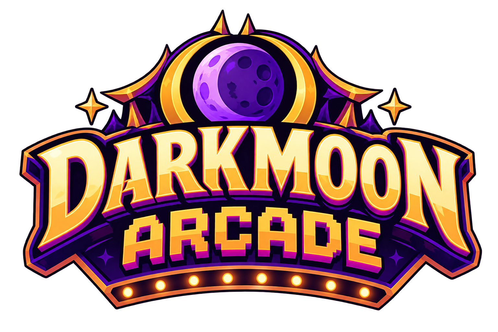

<p align="center"></p>

# Darkmoon Arcade

A growing collection of polished mini games for **World of Warcraft: Forever**, built for long flight paths.
The arcade opens automatically when you take off, shows the remaining flight time and pauses your game on landing.

## Games

| Game | Genre | Highlights |
|---|---|---|
| **Spellbounce** | Peg shooter | All nine classic classes with their own powers, 15 maps with moving runes, fireworks finale |
| **Murloc Blast** | Bubble shooter | Three difficulties, stone bubbles, bombs, endless procedural levels |
| **Flappy Griffin** | One-button flyer | The client's own gryphon, Darkmoon tickets, four medals |
| **Jewels of Uldum** | Match three | Flame gems and prisms, cascades, Classic and Blitz modes |
| **Goblin Slot Machine** | Deck-building slot machine | 17 symbols with neighbor synergies, rising rent to the goblin banker |
| **Darkmoon Deck** | Poker roguelite | 32-card Darkmoon deck, 15 Darkmoon cards that bend the rules, faire folk as bosses |

Every game comes with:

- top 10 highscores and a **guild leaderboard** (shared silently between guild members running the addon)
- **achievements** with toasts
- sharing your score to say, party, guild or a whisper
- a help page with rules and controls

## Features

- Opens on flights with the game of your choice (or the game selection, or not at all)
- Live estimate of the remaining flight time; known routes use their last measured duration
- Pauses on landing and when you enter combat
- Minimap button and an entry in the AddOns compartment
- Options inside the arcade window and in Blizzard's settings panel
- English, German, French, Spanish, Russian and Simplified Chinese

## Installation

1. Download the latest release.
2. Copy the `DarkmoonArcade` folder into `World of Warcraft/_classic_beta_/Interface/AddOns/`.
3. Restart the game.

## Commands

| Command | Action |
|---|---|
| `/arcade` | Open or close the arcade |
| `/arcade options` | Open the options |
| `/arcade minimap` | Show or hide the minimap button |
| `/arcade reset` | Reset highscores and progress |
| `/arcade <game id>` | Open a game directly, e.g. `/arcade murlocblast` |

## Development

The game logic of every game is plain Lua without WoW API calls, so it runs and is tested outside the client.

```bash
pip install lupa pillow numpy
python tests/run.py      # game logic tests (LuaJIT)
python tests/smoke.py    # whole addon against a mocked WoW API
```

All textures and sounds that ship with the addon are generated by the scripts in `tools/`
(`gen_assets.py`, `gen_arcade.py`, `gen_uldum.py`, `gen_goblin.py`, `gen_spellbounce.py`, `gen_darkmoondeck.py`; `ffmpeg` is needed for the sounds).
`tools/import_art.py` turns the logo artwork in `art/` into game textures.
`tools/deploy.ps1` links the addon folder into a local WoW installation for testing.

### Adding a game

Games live in `DarkmoonArcade/Games/<Name>/` and register themselves with `ns.Arcade.RegisterGame`.
The existing games are the reference for the module interface (build, enter/leave, pause, sidebar, options).

## Assets and legal

- Icons, 3D models and creature voices are **not** included. They are referenced by file ID and loaded from the
  game client at runtime.
- All other textures and sounds are generated by the scripts in this repository.
- World of Warcraft, Warcraft and Blizzard Entertainment are trademarks or registered trademarks of
  Blizzard Entertainment, Inc. This project is a fan-made addon and is not affiliated with or endorsed by Blizzard.
- The games are inspired by classic arcade genres; they share no code, art or names with the games that inspired them.

## License

[MIT](LICENSE)
